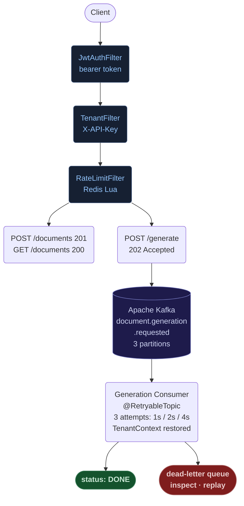
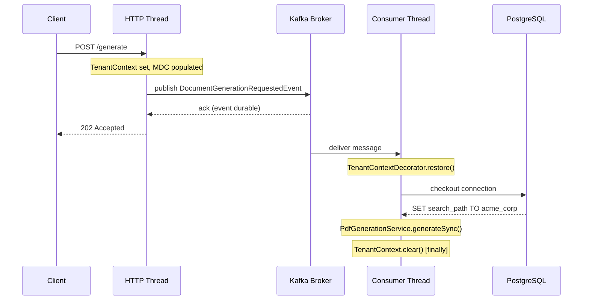

<div align="center">

# EMIT

[](https://openjdk.org/projects/jdk/21/) [](https://spring.io/projects/spring-boot) [](https://www.postgresql.org/) [](https://redis.io/) [](https://kafka.apache.org/) [](https://github.com/FDTTO/emit/actions/workflows/ci.yml) [](LICENSE)

<br/>

**B2B multi-tenant document processing engine.**

Accepts an HTTP request to generate a PDF, returns `202 Accepted` immediately, and processes asynchronously through Kafka. Each tenant runs in an isolated PostgreSQL schema. Rate limiting is distributed and atomic across any number of instances.

Three production failure modes. Three structural solutions. 40 tests that prove the contract holds.

</div>

---

## Table of Contents

- [The Problem](#the-problem)
- [Architecture](#architecture)
- [Four Structural Decisions](#four-structural-decisions)
- [Tech Stack](#tech-stack)
- [Quick Start](#quick-start)
- [API Reference](#api-reference)
- [Testing](#testing)
- [Roadmap](#roadmap)

---

## The Problem

Multi-tenant systems fail in predictable ways.

- **Data leak.** A missing `WHERE tenant_id = ?` on one repository method exposes every tenant's data. No exception, no log line. Silent.
- **Lost work.** `@Async` drops requests under burst. Process restarts silently discard everything in-flight. No retry, no trace.
- **Rate limit bypass.** An in-memory counter behind three replicas gives every tenant three times the configured limit. Permanently.

These are not edge cases. They are the default outcome when isolation, durability, and distributed state are treated as implementation details.

EMIT treats each as a structural problem requiring a structural solution.

---

## Architecture



---

## Four Structural Decisions

| Concern | Chosen | Rejected | Root reason |
|:---|:---|:---|:---|
| Tenant isolation | Schema per tenant | Row-level security | Structural guarantee, not policy enforcement |
| Async processing | Kafka + DLQ | @Async + ThreadPool | Durable before response, retries explicit |
| Rate limiting | Redis Lua sliding window | Bucket4j ConcurrentHashMap | Distributed correctness across instances |
| Filter execution | SecurityFilterChain | @Order servlet filters | SecurityContext initialized, ASYNC dispatch handled |

---

### Schema Isolation: a boundary the database enforces, not the application

Row-level security enforces boundaries through policies on shared tables. A missing policy on a new table returns cross-tenant data with no error. The application has no indication anything is wrong. This failure mode requires active vigilance across every migration and every repository method.

Schema isolation moves the boundary to the database namespace. `SchemaMultiTenantConnectionProvider` issues `SET search_path TO {schema}` on every JDBC connection checkout. A missing schema resolves zero tables. A wrong schema resolves zero tables. No policy to forget, no filter to omit.

Tenant schemas are provisioned automatically on creation and reconciled against the full Liquibase changelog on every application startup.

```
POST /v1/tenants
  ├── INSERT INTO public.tenants    (SHA-256 stored, raw key returned once)
  ├── CREATE SCHEMA {schemaName}
  └── liquibase.update(schema = {schemaName})
        ├── 001_create_documents.sql
        └── 002_add_updated_at.sql

Application startup: TenantMigrationRunner
  ├── SELECT schema_name FROM public.tenants
  └── for each: liquibase.update()    (idempotent, schema drift is impossible)
```

<details>
<summary>Side-by-side: column isolation vs. schema isolation</summary>

```java
// Column-based: tenant_id on every table, filter on every query.
// One method without the filter leaks all tenants' data silently.

Optional<Document> findByIdAndTenantId(UUID id, UUID tenantId);
List<Document> findAllByTenantIdOrderByCreatedAtDesc(UUID tenantId, Pageable p);
// ...every migration, every repository, every query: add the filter or leak
```

```java
// EMIT: no tenant_id in the domain. No filters in queries.

Optional<Document> findById(UUID id);
List<Document> findAll(Pageable pageable);

// SchemaMultiTenantConnectionProvider sets search_path before any query executes.
// Standard Spring Data JPA. The isolation is invisible to application code.
// Wrong search_path resolves zero tables. Leaks are structurally impossible.
```

</details>

> [!NOTE]
> Schema isolation adds provisioning overhead and increases the object count in `pg_catalog`. For a B2B service with a bounded, known tenant set this is the right trade. For a consumer product with millions of users, row-level filtering scales better.

---

### Kafka: the event is durable before the HTTP response returns

`@Async` has two failure modes that matter in production.

Thread pool exhaustion under burst traffic causes callers to receive `RejectedExecutionException` or block indefinitely. The request is gone. No record, no retry, no alert. Process restarts silently drop everything in-flight. Again: no record, no retry, no alert. Both failures are undetectable from the outside.

Kafka shifts the durability boundary. The event is on broker disk before the HTTP response leaves the server. Consumer lag is a metric. Retry policy is a configuration, not a catch block. Messages that exhaust three attempts with 1s / 2s / 4s exponential backoff route to `document.generation.requested.dlq` for inspection and replay. The HTTP caller always receives `202 Accepted` immediately, regardless of consumer state.

Tenant context crosses the thread boundary via `TenantContextDecorator`, which snapshots the schema name and full MDC map from the HTTP thread before the event is dispatched, and restores both inside the consumer thread before any JDBC connection is checked out.

`TenantFilter` writes `tenantSchema` and a per-request `requestId` (UUID) into the MDC on every request. Every log line, including those emitted inside Kafka consumer threads after the context is restored, carries these two fields automatically. HTTP request logs and the corresponding consumer processing logs share the same `requestId`, making production correlation trivial without any tracing infrastructure.



<details>
<summary>Side-by-side: @Async vs. Kafka</summary>

```java
// @Async: fast to write, invisible failure modes

@Async
public CompletableFuture<Void> generatePdf(UUID documentId) {
    // Thread pool full? RejectedExecutionException. Caller fails. No trace.
    // Process restart? Task gone. No retry. No log.
    // How many are in-flight? You cannot know.
    pdfRenderer.render(documentId);
    return CompletableFuture.completedFuture(null);
}
```

```java
// EMIT: 202 + durable event

@PostMapping("/{id}/generate")
public ResponseEntity<Void> generate(@PathVariable UUID id) {
    documentService.findById(id);
    eventPublisher.publishGenerationRequested(
            new DocumentGenerationRequestedEvent(id, TenantContext.getTenant()));
    return ResponseEntity.accepted().build();
    // Event is on disk before this line executes.
}

@RetryableTopic(attempts = "3",
                backoff = @Backoff(delay = 1000, multiplier = 2),
                dltTopicSuffix = ".dlq")
@KafkaListener(topics = TOPIC, groupId = "emit-pdf-processor")
public void consume(ConsumerRecord<String, DocumentGenerationRequestedEvent> record) {
    TenantContext.setTenant(record.value().tenantSchema());
    try {
        pdfGenerationService.generateSync(record.value().documentId());
    } finally {
        TenantContext.clear();
    }
}
```

</details>

> [!IMPORTANT]
> `DispatcherType.ASYNC` must be `permitAll()` in `SecurityConfig`. Kafka consumer threads re-enter the servlet container when dispatching async responses. Without this, `JwtAuthFilter` intercepts them and rejects them. This is the class of subtle breakage that `@Order` filters never expose because they execute outside the security context entirely.

---

### Redis Lua: one atomic operation, any number of instances

Bucket4j is a well-engineered library. The limitation is not in the library: it is in where the state lives.

A token bucket stored in a `ConcurrentHashMap` is process-local. A deployment behind a load balancer with N replicas gives every tenant N times the configured limit, because each JVM enforces its own independent counter. The only way to fix this with Bucket4j is to configure a distributed backend, at which point Bucket4j becomes a wrapper around the same Redis operations EMIT uses directly.

EMIT uses a Redis sorted set with a Lua script that executes atomically: remove entries outside the window, count what remains, conditionally insert the new request, set expiry. Redis executes Lua scripts single-threaded. The read-modify-write is indivisible. No distributed lock, no `WATCH/MULTI/EXEC`, no race condition. Any number of application instances sharing the cluster enforce the exact same limit per tenant.

```lua
-- Four commands, one atomic operation
ZREMRANGEBYSCORE key -inf (now - window)   -- evict stale entries
count = ZCARD key                           -- count current window

if count < limit then
    ZADD  key now jti                       -- admit: record this request
    PEXPIRE key window                      -- self-cleaning, no eviction job
    return 1                                -- allowed
end
return 0                                    -- rejected: 429 Too Many Requests
```

<details>
<summary>Side-by-side: in-memory vs. distributed</summary>

```java
// Bucket4j in-memory: correct on one JVM, wrong on N

private final Map<String, Bucket> buckets = new ConcurrentHashMap<>();

public boolean tryConsume(String tenantSchema) {
    return buckets
        .computeIfAbsent(tenantSchema, k -> Bucket.builder()
            .addLimit(Bandwidth.simple(100, Duration.ofMinutes(1)))
            .build())
        .tryConsume(1);
    // Three replicas: effective limit is 300 req/min per tenant.
    // Memory grows with tenant count, never shrinks.
    // No cross-instance visibility.
}
```

```java
// EMIT: one atomic operation, any number of instances

public boolean tryConsume(String tenantSchema) {
    long now = System.currentTimeMillis();
    Long result = redisTemplate.execute(
            SLIDING_WINDOW_SCRIPT,
            List.of("rl:" + tenantSchema),
            String.valueOf(now),
            String.valueOf(60_000L),
            String.valueOf(properties.getRequestsPerMinute()),
            UUID.randomUUID().toString());
    return Long.valueOf(1L).equals(result);
}
```

</details>

> [!NOTE]
> Every rate-limit check is a Redis round-trip. At intra-datacenter latencies this is sub-millisecond and acceptable. Tenant keys expire automatically after one full window: idle tenants leave no residue in Redis without any eviction job.

---

### SecurityFilterChain: initialization order that @Order cannot guarantee

Servlet filters registered with `@Order` execute as independent filters before `SecurityFilterChain` runs. `SecurityContextHolder` is not initialized at that point.

`TenantFilter` writes a `TenantAuthentication` object to `SecurityContextHolder`. With `@Order`, the write happens before the context exists and is overwritten when the chain initializes. `RateLimitFilter` reads the tenant identity that `TenantFilter` established: with `@Order`, that identity is not there.

Registering inside `SecurityFilterChain` via `addFilterBefore` / `addFilterAfter` gives initialized `SecurityContext`, explicit ordering, and correct handling of `DispatcherType.ASYNC` requests from a single configuration point.

```java
http
    .addFilterBefore(tenantFilter,     UsernamePasswordAuthenticationFilter.class)
    .addFilterAfter(rateLimitFilter,   TenantFilter.class);
```

---

## Tech Stack

| Technology | Version | Role |
|:---|:---|:---|
| Java | 21 | Core language |
| Spring Boot | 3.5 | Web, Data JPA, Security, Validation, Actuator |
| PostgreSQL | 16 | Persistence with schema-based multi-tenancy |
| Apache Kafka | via Spring | Event-driven async generation, @RetryableTopic, DLQ |
| Redis | 7 | Distributed sliding-window rate limiting |
| Liquibase | via Spring | Versioned schema migrations, `ddl-auto=none` |
| JJWT | 0.12.5 | JWT generation and validation (HMAC-SHA256) |
| Flying Saucer | 9.1.22 | HTML-to-PDF rendering via Thymeleaf |
| Testcontainers | via Spring | PostgreSQL, Kafka, Redis for integration tests |
| springdoc-openapi | 2.8.9 | OpenAPI 3 spec + Swagger UI at `/swagger-ui` |
| Lombok | via Spring | Compile-time code generation, excluded from fat JAR |

---

## Quick Start

Requires Docker Desktop, Java 21, and Maven 3.9+.

```bash
git clone https://github.com/FDTTO/emit.git && cd emit
docker compose up -d
mvn spring-boot:run
```

Open `http://localhost:8080/swagger-ui/index.html`.

**1. Authenticate as admin**

```http
POST /auth/login
Content-Type: application/json

{ "username": "admin", "password": "admin123" }
```

Copy the `token` from the response. Click **Authorize** in Swagger and paste it under `bearerAuth`.

**2. Create a tenant**

```http
POST /v1/tenants
Authorization: Bearer <token>
Content-Type: application/json

{ "name": "Acme Corp", "schemaName": "acme_corp" }
```

Copy the `apiKey`. Returned exactly once, stored as SHA-256. Click **Authorize** and paste under `apiKeyAuth`.

**3. Process a document**

```http
POST /v1/documents                   # 201 Created,  status: PENDING
POST /v1/documents/{id}/generate     # 202 Accepted, event published to Kafka
GET  /v1/documents/{id}              # poll until    status: DONE
```

---

## API Reference

### Authentication

#### POST /auth/login

```json
{ "username": "admin", "password": "admin123" }
```

Response `200 OK`:

```json
{ "token": "eyJhbGci..." }
```

Use as `Authorization: Bearer <token>` on all tenant management routes.

---

### Tenants `Authorization: Bearer <token>`

#### POST /v1/tenants — Create tenant `201 Created`

```json
{ "name": "Acme Corp", "schemaName": "acme_corp" }
```

Response:

```json
{
  "id": "f1e2d3c4-b5a6-4c3d-8e9f-a0b1c2d3e4f5",
  "name": "Acme Corp",
  "schemaName": "acme_corp",
  "apiKey": "a3f8c2e1d4b796f0e5d3c2b1a0f9e8d7",
  "createdAt": "2026-08-15T10:30:00Z"
}
```

`schemaName` constraint: `[a-z][a-z0-9_]{1,62}`. Lowercase, starts with a letter, no hyphens, max 63 chars.

> [!IMPORTANT]
> `apiKey` is returned exactly once and cannot be recovered. Store it securely immediately.

#### GET /v1/tenants — List all tenants `200 OK`

```json
[
  { "id": "f1e2d3c4-b5a6-4c3d-8e9f-a0b1c2d3e4f5", "name": "Acme Corp", "schemaName": "acme_corp", "createdAt": "2026-08-15T10:30:00Z" },
  { "id": "a2b3c4d5-e6f7-8a9b-0c1d-2e3f4a5b6c7d", "name": "Globex",    "schemaName": "globex",    "createdAt": "2026-08-15T11:00:00Z" }
]
```

#### GET /v1/tenants/{id} — Get tenant by ID `200 OK` / `404 Not Found`

---

### Documents `X-API-Key: <key>`

#### POST /v1/documents — Create document `201 Created`

```json
{ "title": "Q3 Invoice", "content": "<h1>Invoice</h1>..." }
```

Response `201 Created`:

```json
{
  "id": "9a8b7c6d-e5f4-3a2b-1c0d-e9f8a7b6c5d4",
  "title": "Q3 Invoice",
  "status": "PENDING",
  "createdAt": "2026-08-15T10:31:00Z",
  "updatedAt": "2026-08-15T10:31:00Z"
}
```

Constraints: `title` max 255 chars, `content` max 50,000 chars.

Response `400 Bad Request` (validation failure):

```json
{
  "status": 400,
  "error": "Bad Request",
  "violations": {
    "title": "must not be blank",
    "content": "size must be between 0 and 50000"
  }
}
```

#### POST /v1/documents/{id}/generate — Request generation `202 Accepted`

No request body. Returns immediately. Publishes a `DocumentGenerationRequestedEvent` to Kafka. Poll `GET /v1/documents/{id}` to track progress.

**Status lifecycle:**

```
PENDING → PROCESSING → DONE
                    └── FAILED → .dlq  (after 3 retry attempts, exponential backoff)
```

#### GET /v1/documents/{id} — Get document `200 OK`

```json
{
  "id": "9a8b7c6d-e5f4-3a2b-1c0d-e9f8a7b6c5d4",
  "title": "Q3 Invoice",
  "status": "DONE",
  "createdAt": "2026-08-15T10:31:00Z",
  "updatedAt": "2026-08-15T10:31:45Z"
}
```

#### GET /v1/documents — List documents `200 OK`

Paginated. Query params: `page` (default `0`), `size` (default `20`), `sort` (default `createdAt,desc`).

```json
{
  "content": [ { "id": "...", "title": "...", "status": "DONE", "createdAt": "..." } ],
  "totalElements": 42,
  "totalPages": 3,
  "number": 0,
  "size": 20
}
```

---

## Testing

40 tests. No mocks for infrastructure: PostgreSQL, Kafka, and Redis use real containers.

```
Unit  (Mockito + JUnit 5)
├── DocumentTest                       domain factory, state machine transitions     [4]
├── PdfGenerationServiceTest           generateSync: success, exception, state       [3]
├── TenantFilterTest                   valid key, absent key, invalid key,
│                                      requestId in MDC, finally cleanup             [5]
├── TenantContextDecoratorTest         tenant propagation, MDC propagation,
│                                      cleanup on success, cleanup on exception,
│                                      null MDC handled safely                       [5]
└── DocumentGenerationConsumerTest     generateSync called with correct id,
                                       TenantContext cleared on success,
                                       TenantContext cleared on exception            [3]

Slice  (@WebMvcTest)
├── DocumentControllerTest             list, paginate, create, three 400 validations
│                                      (blank title, title over 255, content over 50k),
│                                      404, 202 on generate                          [8]
└── TenantControllerTest               create 201, schemaName validation failures
                                       (digit-start, uppercase, hyphen, single char,
                                       blank), 404 findById, list 200                [8]

Integration  (Testcontainers: real containers, no test doubles)
├── RateLimiterServiceTest             within limit, exhausted, tenant isolation      [3]
│   └── GenericContainer  redis:7-alpine
└── DocumentIntegrationTest            full lifecycle PENDING to DONE                [1]
    ├── PostgreSQLContainer  16-alpine
    ├── ConfluentKafkaContainer  7.6.1
    └── GenericContainer  redis:7-alpine
```

Docker must be running:

```bash
mvn test
```

---

## Roadmap

- [x] Multi-tenancy via PostgreSQL schema isolation
- [x] JWT authentication with role-based admin access
- [x] Kafka event-driven PDF generation with @RetryableTopic and DLQ
- [x] Redis distributed sliding-window rate limiting (atomic Lua script)
- [x] Testcontainers integration tests for PostgreSQL, Kafka, and Redis
- [x] GitHub Actions CI pipeline
- [ ] Package by Feature + Hexagonal Architecture refactor
- [ ] Webhook notification on generation completion (eliminate polling)
- [ ] Full cloud deployment with Kafka and Redis provisioned

---

## Author

**Matheus Fedatto** | [LinkedIn](https://www.linkedin.com/in/matheusfedatto) | [GitHub](https://github.com/FDTTO)

---

## License

[MIT](LICENSE)
