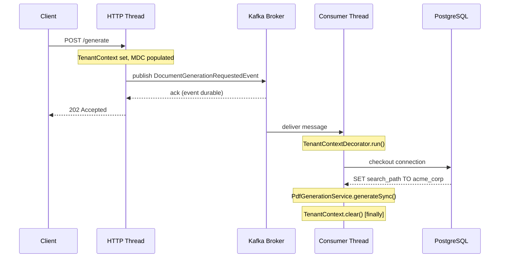

<div align="center">

# EMIT

[](https://openjdk.org/projects/jdk/21/) [](https://spring.io/projects/spring-boot) [](https://www.postgresql.org/) [](https://redis.io/) [](https://kafka.apache.org/) [](https://github.com/FDTTO/emit/actions/workflows/ci.yml) [](LICENSE)

<br/>

**B2B multi-tenant document processing engine.**

Accepts an HTTP request to generate a PDF, returns `202 Accepted` immediately, and processes asynchronously through Kafka. Each tenant runs in an isolated PostgreSQL schema. Rate limiting is distributed and atomic across any number of instances.

Five structural decisions. 138 tests that prove the contract holds.

</div>

---

## Table of Contents

- [The Problem](#the-problem)
- [Architecture](#architecture)
- [Five Structural Decisions](#five-structural-decisions)
- [Tech Stack](#tech-stack)
- [Quick Start](#quick-start)
- [API Reference](#api-reference)
- [Testing](#testing)
- [Roadmap](#roadmap)

---

## The Problem

Multi-tenant systems fail in predictable ways.

- **Data leak.** A missing `WHERE tenant_id = ?` on one repository method exposes every tenant's data. No exception, no log line. Silent.
- **Lost work.** `@Async` drops requests under burst. Process restarts silently discard everything in-flight. No retry, no trace.
- **Rate limit bypass.** An in-memory counter behind three replicas gives every tenant three times the configured limit. Permanently.

These are not edge cases. They are the default outcome when isolation, durability, and distributed state are treated as implementation details.

EMIT treats each as a structural problem requiring a structural solution.

---

## Architecture


---

## Five Structural Decisions

| Concern | Chosen | Rejected | Root reason |
|:---|:---|:---|:---|
| Tenant isolation | Schema per tenant | Row-level security | Structural guarantee, not policy enforcement |
| Async processing | Kafka + DLQ | @Async + ThreadPool | Durable before response, retries explicit |
| Rate limiting | Redis Lua sliding window | Bucket4j ConcurrentHashMap | Distributed correctness across instances |
| Filter execution | SecurityFilterChain | @Order servlet filters | SecurityContext initialized, ASYNC dispatch handled |
| Code organization | Package by Feature + Hexagonal | Layered (controller/service/repository) | Feature cohesion, domain free of framework dependencies |

Each section below names a failure mode, the structural choice that eliminates it, and the trade-off accepted in return.

---

### Schema Isolation

*The boundary lives in the database, not the application.*

Row-level security enforces boundaries through policies on shared tables. A missing policy on a new table returns cross-tenant data with no error. The application has no indication anything is wrong. This failure mode requires active vigilance across every migration and every repository method.

Schema isolation moves the boundary to the database namespace. `SchemaMultiTenantConnectionProvider` issues `SET search_path TO {schema}` on every JDBC connection checkout. A missing schema resolves zero tables. A wrong schema resolves zero tables. No policy to forget, no filter to omit.

Tenant schemas are provisioned automatically on creation and reconciled against the full Liquibase changelog on every application startup.

```
POST /v1/tenants
  ├── INSERT INTO public.tenants    (SHA-256 stored, raw key returned once)
  ├── CREATE SCHEMA {schemaName}
  └── liquibase.update(schema = {schemaName})
        ├── 001_create_documents.sql
        └── 002_add_updated_at.sql

Application startup: TenantMigrationRunner
  ├── SELECT schema_name FROM public.tenants
  └── for each: liquibase.update()    (idempotent, schema drift is impossible)
```

> [!NOTE]
> Schema isolation adds provisioning overhead and increases the object count in `pg_catalog`. The right trade for a B2B service with a bounded, known tenant set. For a consumer product with millions of users, row-level filtering scales better.

<details>
<summary>Side-by-side: what the repository layer looks like with and without schema isolation</summary>

```java
// Column-based: tenant_id on every table, filter on every query.
// One method without the filter leaks all tenants' data silently.

Optional<Document> findByIdAndTenantId(UUID id, UUID tenantId);
List<Document> findAllByTenantIdOrderByCreatedAtDesc(UUID tenantId, Pageable p);
// ...every migration, every repository, every query: add the filter or leak
```

```java
// EMIT: no tenant_id in the domain. No filters in queries.

Optional<Document> findById(UUID id);
List<Document> findAll(Pageable pageable);

// SchemaMultiTenantConnectionProvider sets search_path before any query executes.
// Standard Spring Data JPA. The isolation is invisible to application code.
// Wrong search_path resolves zero tables. Leaks are structurally impossible.
```

</details>

---

### Kafka + Dead-Letter Queue

*The event is durable before the HTTP response returns.*

`@Async` has two failure modes that matter in production.

Thread pool exhaustion under burst traffic causes callers to receive `RejectedExecutionException` or block indefinitely. The request is gone. No record, no retry, no alert. Process restarts silently drop everything in-flight. Again: no record, no retry, no alert. Both failures are undetectable from the outside.

Kafka shifts the durability boundary. The event is on broker disk before the HTTP response leaves the server. Consumer lag is a metric. Retry policy is a configuration, not a catch block. Messages that exhaust three attempts with 1s + 2s exponential backoff route to `document.generation.requested.dlq` for inspection and replay. The HTTP caller always receives `202 Accepted` immediately, regardless of consumer state.

Tenant context crosses the thread boundary via `TenantContextDecorator`, which sets schema name and MDC entries from the deserialized event before any JDBC connection is checked out, then clears both in a `finally` block. This isolates the restore-and-clear pattern as a single responsibility in `shared/multitenancy`, so any number of consumers propagate tenant context without duplicating the try/finally logic.

`generateSync` is idempotent for `@RetryableTopic` retries: if a prior attempt failed after `PROCESSING` was committed to the database, the next attempt recognizes the state and proceeds directly to rendering. Without this, a second attempt throws `IllegalStateException` on a `PROCESSING` document, logs a misleading error, and retries the wrong failure mode all the way to the dead-letter queue.

`TenantFilter` writes `tenantSchema` and a per-request `requestId` into the MDC on every request. Every log line emitted inside Kafka consumer threads, after the context is restored from the event, carries these fields automatically. HTTP request logs and consumer processing logs share the same `requestId`, making production correlation trivial without any tracing infrastructure.



<details>
<summary>Side-by-side: what changes when you swap @Async for Kafka</summary>

```java
// @Async: fast to write, invisible failure modes

@Async
public CompletableFuture<Void> generatePdf(UUID documentId) {
    // Thread pool full? RejectedExecutionException. Caller fails. No trace.
    // Process restart? Task gone. No retry. No log.
    // How many are in-flight? You cannot know.
    pdfRenderer.render(documentId);
    return CompletableFuture.completedFuture(null);
}
```

```java
// EMIT: 202 + durable event

@PostMapping("/{id}/generate")
public ResponseEntity<Void> generate(@PathVariable UUID id) {
    documentService.requestGeneration(id);
    return ResponseEntity.accepted().build();
    // Event is on disk before this line executes.
}

@RetryableTopic(attempts = "3",
                backoff = @Backoff(delay = 1000, multiplier = 2),
                dltTopicSuffix = ".dlq")
@KafkaListener(topics = TOPIC, groupId = "emit-pdf-processor")
void consume(ConsumerRecord<String, DocumentGenerationRequestedEvent> record) {
    DocumentGenerationRequestedEvent event = record.value();
    tenantContextDecorator.run(
            event.tenantSchema(),
            Map.of("tenantSchema", event.tenantSchema(), "documentId", event.documentId().toString()),
            () -> pdfGenerationService.generateSync(event.documentId()));
}
```

</details>

---

### Redis Lua Rate Limiting

*One atomic operation, any number of instances.*

Bucket4j is a well-engineered library. The limitation is not in the library: it is in where the state lives.

A token bucket stored in a `ConcurrentHashMap` is process-local. A deployment behind a load balancer with N replicas gives every tenant N times the configured limit, because each JVM enforces its own independent counter. The only way to fix this with Bucket4j is to configure a distributed backend, at which point Bucket4j becomes a wrapper around the same Redis operations EMIT uses directly.

EMIT uses a Redis sorted set with a Lua script that executes atomically: remove entries outside the window, count what remains, conditionally insert the new request, set expiry. Redis executes Lua scripts single-threaded. The read-modify-write is indivisible. No distributed lock, no `WATCH/MULTI/EXEC`, no race condition. Any number of application instances sharing the cluster enforce the exact same limit per tenant.

```lua
-- Four commands, one atomic operation
ZREMRANGEBYSCORE key -inf (now - window)   -- evict stale entries
count = ZCARD key                           -- count current window

if count < limit then
    ZADD  key now jti                       -- admit: record this request
    PEXPIRE key window                      -- self-cleaning, no eviction job
    return 1                                -- allowed
end
return 0                                    -- rejected: 429 Too Many Requests
```

<details>
<summary>Side-by-side: what the rate limiter looks like in-memory vs. distributed</summary>

```java
// Bucket4j in-memory: correct on one JVM, wrong on N

private final Map<String, Bucket> buckets = new ConcurrentHashMap<>();

public boolean tryConsume(String tenantSchema) {
    return buckets
        .computeIfAbsent(tenantSchema, k -> Bucket.builder()
            .addLimit(Bandwidth.simple(100, Duration.ofMinutes(1)))
            .build())
        .tryConsume(1);
    // Three replicas: effective limit is 300 req/min per tenant.
    // Memory grows with tenant count, never shrinks.
    // No cross-instance visibility.
}
```

```java
// EMIT: one atomic operation, any number of instances

public boolean tryConsume(String tenantSchema) {
    long now = System.currentTimeMillis();
    Long result = redisTemplate.execute(
            SLIDING_WINDOW_SCRIPT,
            List.of("rl:" + tenantSchema),
            String.valueOf(now),
            String.valueOf(60_000L),
            String.valueOf(properties.getRequestsPerMinute()),
            UUID.randomUUID().toString());
    return Long.valueOf(1L).equals(result);
}
```

</details>

---

### SecurityFilterChain

*Initialization order that `@Order` cannot guarantee.*

Servlet filters registered with `@Order` execute as independent filters before `SecurityFilterChain` runs. `SecurityContextHolder` is not initialized at that point.

`TenantFilter` writes a `TenantAuthentication` object to `SecurityContextHolder`. With `@Order`, the write happens before the context exists and is overwritten when the chain initializes. `RateLimitFilter` reads the tenant identity that `TenantFilter` established: with `@Order`, that identity is not there.

Registering inside `SecurityFilterChain` via `addFilterBefore` / `addFilterAfter` gives initialized `SecurityContext`, explicit ordering, and correct handling of `DispatcherType.ASYNC` requests: all from a single configuration point.

```java
http
    .addFilterBefore(tenantFilter,     UsernamePasswordAuthenticationFilter.class)
    .addFilterAfter(rateLimitFilter,   TenantFilter.class)
    .addFilterBefore(jwtFilter,        UsernamePasswordAuthenticationFilter.class);
```

> [!IMPORTANT]
> `DispatcherType.ASYNC` must be `permitAll()` in `SecurityConfig`. Kafka consumer threads re-enter the servlet container when dispatching async responses. Without this, `JwtAuthFilter` intercepts them and rejects them. This is exactly the class of subtle breakage that `@Order` filters never expose: they execute outside the security context entirely.

---

### Package by Feature + Hexagonal

*Each feature owns its complete vertical slice.*

Layered architecture organizes code by technical concern: `controller/`, `service/`, `repository/`. One feature spans three packages. A change in document processing touches files across all three. Import boundaries are invisible: nothing prevents `TenantService` from importing `DocumentRepository`.

Package by Feature inverts that axis.

```
document/
├── domain/         Document, DocumentRepository (port), DocumentStatus
├── application/    DocumentService, PdfGenerationService, PdfRenderer (port)
└── adapter/
    ├── in/rest/          DocumentController
    ├── in/messaging/     DocumentGenerationConsumer
    ├── out/persistence/  DocumentRepositoryAdapter
    ├── out/pdf/          FlyingSaucerPdfRenderer
    └── out/template/     ThymeleafDocumentTemplateRenderer
```

Hexagonal Architecture (Ports & Adapters) enforces the dependency direction inside each feature. The domain has no framework imports. Ports are plain Java interfaces. Adapters are package-private: `FlyingSaucerPdfRenderer` is not accessible outside `adapter/out/pdf/`, only through the `PdfRenderer` port. Framework leaks into the domain are structurally impossible (compile-time, not discipline).

<details>
<summary>Side-by-side: what TenantRepository looks like layered vs. hexagonal</summary>

```java
// Layered: TenantRepository leaks Spring Data and JPA into the domain.
// Replacing the persistence layer requires touching the domain interface.

public interface TenantRepository extends JpaRepository<Tenant, UUID> {
    Optional<Tenant> findByApiKeyHash(String hash);
}
```

```java
// EMIT: TenantRepository is a plain Java interface: no framework imports.

public interface TenantRepository {
    Optional<Tenant> findById(UUID id);
    Optional<Tenant> findByApiKeyHash(String apiKeyHash);
    Tenant save(Tenant tenant);
    List<Tenant> findAll();
}

// The adapter lives in adapter/out/persistence/ and is package-private.
// Spring Data generates the full implementation automatically.
interface TenantRepositoryAdapter
        extends JpaRepository<Tenant, UUID>, TenantRepository {
}
```

</details>

---

## Tech Stack

| Technology | Version | Role |
|:---|:---|:---|
| Java | 21 | Core language |
| Spring Boot | 3.5 | Web, Data JPA, Security, Validation, Actuator |
| PostgreSQL | 16 | Persistence with schema-based multi-tenancy |
| Apache Kafka | via Spring | Event-driven async generation, @RetryableTopic, DLQ |
| Redis | 7 | Distributed sliding-window rate limiting |
| Liquibase | via Spring | Versioned schema migrations, `ddl-auto=none` |
| JJWT | 0.12.5 | JWT generation and validation (HMAC-SHA256) |
| Flying Saucer | 9.1.22 | HTML-to-PDF rendering via Thymeleaf |
| Testcontainers | via Spring | PostgreSQL, Kafka, Redis for integration tests |
| springdoc-openapi | 2.8.9 | OpenAPI 3 spec + Swagger UI at `/swagger-ui` |
| Lombok | via Spring | Compile-time code generation, excluded from fat JAR |

---

## Quick Start

Requires Docker Desktop, Java 21, and Maven 3.9+.

```bash
git clone https://github.com/FDTTO/emit.git && cd emit
docker compose up -d
mvn spring-boot:run -Dspring-boot.run.profiles=dev
```

The `dev` profile holds the local JWT secret and admin credentials. Without a profile the application refuses to start rather than run on built-in secrets.

Open `http://localhost:8080/swagger-ui/index.html`. The steps below work from any HTTP client; in the console each response also hands its result to the next step.

**1. Authenticate as admin**

```http
POST /v1/auth/login
Content-Type: application/json

{ "username": "admin", "password": "admin123" }
```

The response carries a `token`, sent as `Authorization: Bearer <token>`. In the console, executing the login applies it to **Authorize** for you.

**2. Create a tenant**

```http
POST /v1/tenants
Authorization: Bearer <token>
Content-Type: application/json

{ "name": "Acme Corp", "schemaName": "acme_corp" }
```

The `apiKey` is returned exactly once and stored only as a SHA-256 hash. In the console it is applied to **Authorize** as the tenant credential; elsewhere, send it as `X-API-Key`.

**3. Process a document**

```http
POST /v1/documents
X-API-Key: <key>
Content-Type: application/json

{ "title": "Q3 Invoice", "content": "<h1>Invoice</h1>..." }
```

Then request generation and track status:

```http
POST /v1/documents/{id}/generate    # 202 Accepted, event published to Kafka
GET  /v1/documents/{id}             # poll until status: DONE
GET  /v1/documents/{id}/pdf         # download the generated PDF
```

In the console the created id is filled into these operations, and after `generate` the page follows the document to `DONE`, says how long it took, and offers the PDF.

---

## API Reference

> Full interactive docs: `http://localhost:8080/swagger-ui/index.html`

### Authentication Model

EMIT uses two mechanisms with distinct scopes:

| Scope | Mechanism | Header |
|:---|:---|:---|
| Tenant management | JWT Bearer | `Authorization: Bearer <token>` |
| Document operations | API Key | `X-API-Key: <key>` |

Authenticate at `POST /v1/auth/login` with admin credentials to receive a JWT. Use that JWT to create a tenant; the response includes a raw API key, returned **exactly once**. Use the API key on all document routes.

The two are not interchangeable. An admin token on a document route, or an API key on a tenant route, is refused with `403` in the same error shape as every other error:

```json
{ "status": 403, "message": "This credential cannot access this route. ...", "timestamp": "..." }
```

### Rate Limit Headers

Every document response tells the client where its budget stands, so it can pace itself instead of discovering the limit by hitting it:

| Header | Meaning |
|:---|:---|
| `RateLimit-Limit` | requests allowed per sliding window (per tenant, per minute) |
| `RateLimit-Remaining` | requests left in the current window |
| `RateLimit-Reset` | seconds until the oldest request leaves the window |
| `Retry-After` | on `429` only: seconds until a slot frees |

Every response, refusals included, also carries `X-Request-Id`: the id the request is logged under, so an error can be traced to its exact log lines.

### Endpoints

| Method | Path | Auth | Success |
|:---|:---|:---|:---|
| POST | `/v1/auth/login` | none | 200 |
| POST | `/v1/tenants` | JWT | 201 |
| GET | `/v1/tenants` | JWT | 200 |
| GET | `/v1/tenants/{id}` | JWT | 200 |
| POST | `/v1/tenants/{id}/deactivate` | JWT | 204 |
| POST | `/v1/tenants/{id}/reactivate` | JWT | 204 |
| POST | `/v1/documents` | API Key | 201 |
| GET | `/v1/documents` | API Key | 200 |
| GET | `/v1/documents/{id}` | API Key | 200 |
| POST | `/v1/documents/{id}/generate` | API Key | 202 |
| GET | `/v1/documents/{id}/pdf` | API Key | 200 |

### Document Status Lifecycle

```
PENDING → PROCESSING → DONE
                    └── FAILED

Kafka retry policy: 3 attempts · 1s + 2s backoff · exhausted → document.generation.requested.dlq
```

`schemaName` validation: `[a-z][a-z0-9_]{1,62}` (lowercase, starts with a letter, no hyphens, max 63 chars).

---

## Testing

**138 tests.** No mocks for infrastructure: PostgreSQL, Kafka, and Redis use real containers.

**Unit** (Mockito + JUnit 5) · 92 tests

```
├── DocumentTest                       [13]  factory method, state machine transitions,
│                                            invariants (null PDF, wrong state)
├── DocumentServiceTest                [9]   create, find, requestGeneration, getPdf,
│                                            all not-found and status-conflict paths
├── PdfGenerationServiceTest           [9]   generateSync: success, pdf failure, template
│                                            failure, retry idempotency (PROCESSING state),
│                                            terminal state guard; abandonGeneration
├── FlyingSaucerPdfRendererTest        [2]   URLs in document content are never fetched,
│                                            embedded data: images still render
├── DocumentGenerationConsumerTest     [5]   generateSync called with correct id,
│                                            context cleared on success and on exception,
│                                            DLT handler abandons and clears context
├── TenantServiceTest                  [9]   create, findById, deactivate, reactivate,
│                                            not-found paths, API key generation
├── TenantContextDecoratorTest         [5]   context set before action, MDC populated,
│                                            both cleared on success and on exception
├── TenantFilterTest                   [6]   valid key, absent key, invalid key,
│                                            inactive tenant, requestId always in MDC,
│                                            finally cleanup on downstream exception
├── TenantIdentifierResolverTest       [3]   resolves from context, falls back to public
├── TenantSchemaValidatorTest          [7]   valid, public, null, single-char,
│                                            digit-start, uppercase, hyphen
├── ApiKeyHasherTest                   [3]   hash determinism, hex format, length
├── JwtServiceTest                     [4]   generate, validate, extract subject,
│                                            reject expired token
├── JwtAuthenticationFilterTest        [4]   valid token sets context, invalid token 401,
│                                            absent header passes through, an earlier
│                                            tenant role is kept alongside admin
├── RateLimitFilterTest                [3]   tenant absent, budget headers within limit,
│                                            429 with Retry-After
├── ApiErrorWriterTest                 [2]   JSON declared as UTF-8, status and message
│                                            in the body
├── RequestIdFilterTest                [3]   the id returned is the id logged under,
│                                            one per request, cleared even on failure
└── GlobalExceptionHandlerTest         [5]   unknown URL and removed static file are 404,
                                             a missing internal resource stays 500,
                                             generic 500 leaks no internal detail
```

**Slice** (@WebMvcTest) · 32 tests

```
├── DocumentControllerTest             [16]  list empty, list paginated, create 201,
│                                            find by id, 404, 400 validations (blank title,
│                                            title >255, blank content, content >50k,
│                                            missing body), 202 generate, 409 status
│                                            conflict, 404 on generate, PDF download,
│                                            PDF 409, PDF 404
├── TenantControllerTest               [13]  create 201 with API key, 409 duplicate schema,
│                                            400 validations (digit-start, uppercase,
│                                            hyphen, single-char, blank name), findById,
│                                            404, listAll 200, deactivate 204, deactivate
│                                            404, reactivate 204, reactivate 404
└── AuthControllerTest                 [3]   valid credentials 200, wrong username 401,
                                             wrong password 401
```

**Integration** (Testcontainers: real containers, no test doubles) · 14 tests

```
├── RateLimiterServiceTest             [4]   within limit, remaining counts down to zero,
│                                            exhausted limit says when a slot frees,
│                                            per-tenant isolation
│   └── GenericContainer  redis:7-alpine
├── RouteAccessTest                    [5]   unknown route: 401 without a credential,
│                                            404 with one; a path id that is not a
│                                            UUID is 400; the actuator stays closed;
│                                            even a refusal carries X-Request-Id
├── TenantMigrationsStartupTest        [1]   tenant schemas are migrated before the
│                                            web server accepts a request
├── TenantProvisionerConcurrencyTest   [1]   concurrent tenant schema migrations all
│                                            complete (Liquibase scope is shared across
│                                            threads, so runs are serialized)
│   └── PostgreSQLContainer  16
└── DocumentIntegrationTest            [3]   full lifecycle: login → create tenant →
                                             create document → request generation →
                                             await DONE → download PDF; admin token
                                             refused on tenant routes, API key refused
                                             on admin routes, both as 403
    ├── PostgreSQLContainer  16
    ├── ConfluentKafkaContainer  7.6.1
    └── GenericContainer  redis:7-alpine
```

Docker must be running:

```bash
mvn test
```

---

## Roadmap

- [x] Multi-tenancy via PostgreSQL schema isolation
- [x] JWT authentication with role-based admin access
- [x] Kafka event-driven PDF generation with @RetryableTopic and DLQ
- [x] Redis distributed sliding-window rate limiting (atomic Lua script)
- [x] Testcontainers integration tests for PostgreSQL, Kafka, and Redis
- [x] GitHub Actions CI pipeline
- [x] Package by Feature + Hexagonal Architecture (Ports & Adapters)
- [ ] Webhook notification on generation completion (eliminate polling)
- [ ] Full cloud deployment with Kafka and Redis provisioned

---

## Author

```
███████╗██████╗ ████████╗████████╗ ██████╗
██╔════╝██╔══██╗╚══██╔══╝╚══██╔══╝██╔═══██╗
█████╗  ██║  ██║   ██║      ██║   ██║   ██║
██╔══╝  ██║  ██║   ██║      ██║   ██║   ██║
██║     ██████╔╝   ██║      ██║   ╚██████╔╝
╚═╝     ╚═════╝    ╚═╝      ╚═╝    ╚═════╝
```

[LinkedIn](https://www.linkedin.com/in/matheusfedatto) · [GitHub](https://github.com/FDTTO)

---

## License

[MIT](LICENSE)
