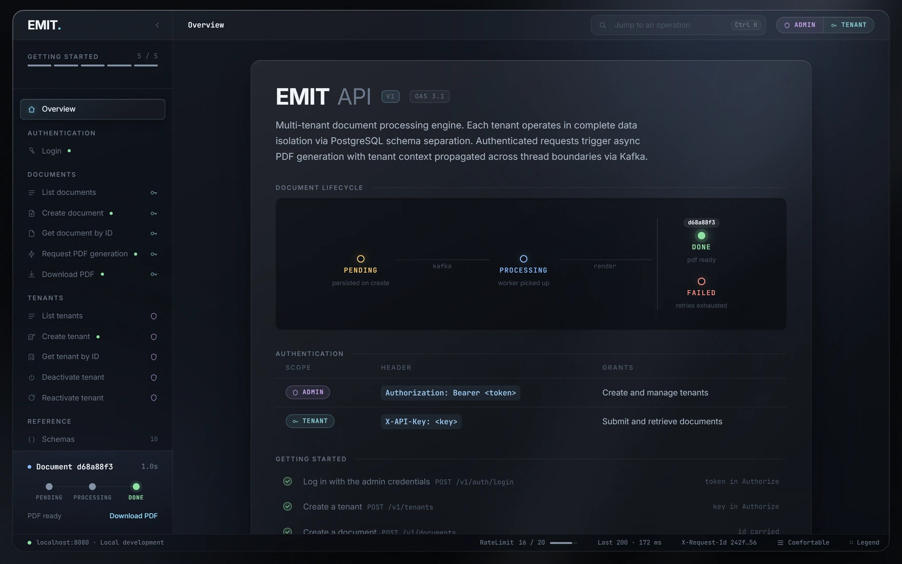
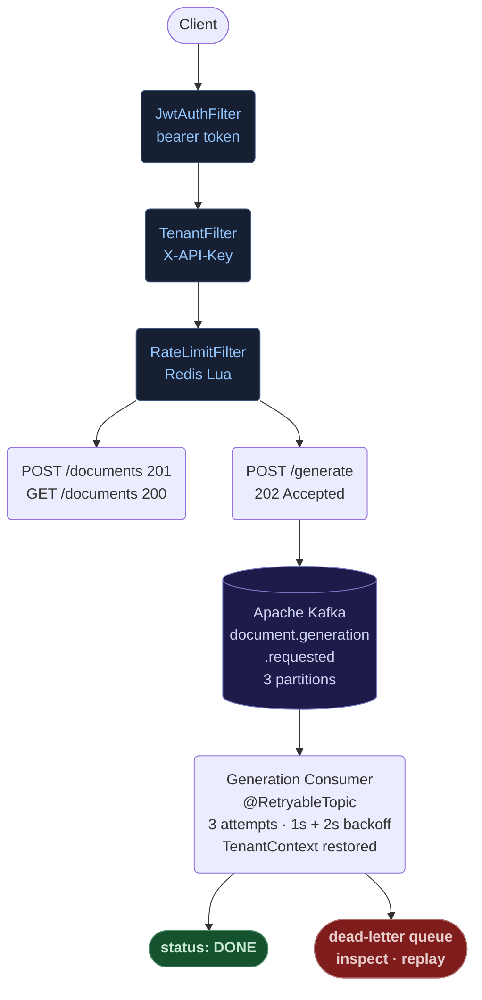
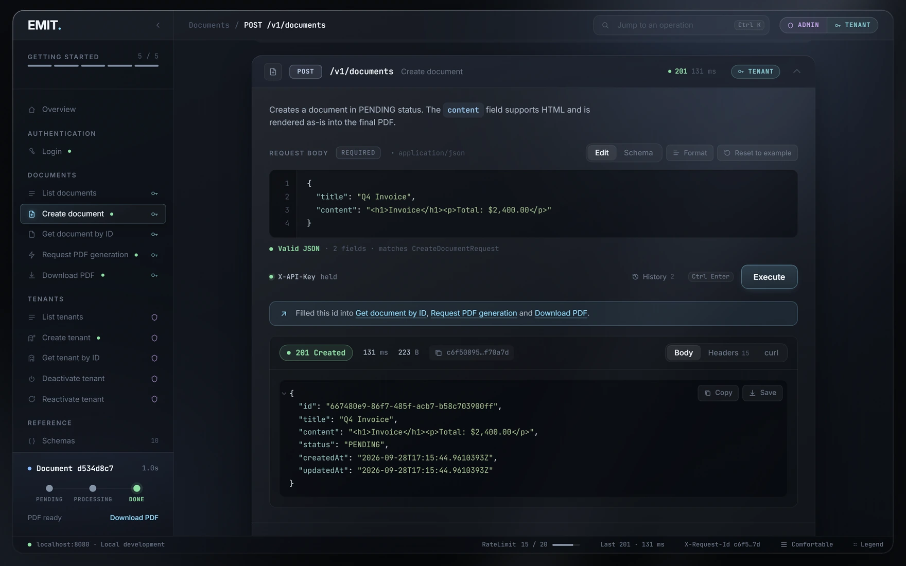

<div align="center">

# EMIT

[](https://openjdk.org/projects/jdk/21/) [](https://spring.io/projects/spring-boot) [](https://www.postgresql.org/) [](https://redis.io/) [](https://kafka.apache.org/) [](https://github.com/FDTTO/emit/actions/workflows/ci.yml) [](LICENSE)

<br/>

**B2B multi-tenant document processing engine.**

Accepts an HTTP request to generate a PDF, returns `202 Accepted` as soon as the request is durable in Kafka, and processes it asynchronously. Each tenant runs in an isolated PostgreSQL schema. Rate limiting is distributed and atomic across any number of instances.

Five structural decisions. 223 tests that prove the contract holds.

**[Try the console live](https://fdtto.github.io/emit/)**, nothing to install.

<br/>

<a href="https://fdtto.github.io/emit/"></a>

</div>

---

## Table of Contents

- [The Problem](#the-problem)
- [Architecture](#architecture)
- [Five Structural Decisions](#five-structural-decisions)
- [Tech Stack](#tech-stack)
- [Quick Start](#quick-start)
- [API Reference](#api-reference)
- [Testing](#testing)
- [Deliberate limits](#deliberate-limits)
- [Roadmap](#roadmap)

---

## The Problem

Multi-tenant systems fail in predictable ways.

- **Data leak.** A missing `WHERE tenant_id = ?` on one repository method exposes every tenant's data. No exception, no log line. Silent.
- **Lost work.** `@Async` drops requests under burst. Process restarts silently discard everything in-flight. No retry, no trace.
- **Rate limit bypass.** An in-memory counter behind three replicas gives every tenant three times the configured limit. Permanently.

These are not edge cases. They are the default outcome when isolation, durability, and distributed state are treated as implementation details.

EMIT treats each as a structural problem requiring a structural solution.

---

## Architecture


```mermaid
%%{init: {'theme': 'dark', 'themeVariables': {'fontFamily': '"Segoe UI", system-ui, sans-serif', 'primaryColor': '#1e293b', 'primaryBorderColor': '#334155', 'primaryTextColor': '#f1f5f9', 'lineColor': '#64748b'}}}%%
flowchart TD
    classDef filter fill:#162032,stroke:#3b5279,color:#93c5fd
    classDef ok     fill:#14532d,stroke:#4d8c6a,color:#c8e6d4,font-weight:bold
    classDef err    fill:#7f1d1d,stroke:#b07070,color:#e8cccc,font-weight:bold
    classDef mq     fill:#1e1b4b,stroke:#7579c0,color:#cdd3f0

    client(["Client"])
    F1("JwtAuthFilter\nbearer token"):::filter
    F2("TenantFilter\nX-API-Key"):::filter
    F3("RateLimitFilter\nRedis Lua"):::filter
    crud("POST /documents  201\nGET  /documents  200")
    gen("POST /generate\n202 Accepted")
    kafka[("Apache Kafka\ndocument.generation\n.requested\n3 partitions")]:::mq
    consumer("Generation Consumer\n@RetryableTopic\n3 attempts · 1s + 2s backoff\nTenantContext restored")
    done(["status: DONE"]):::ok
    dlq(["dead-letter queue\ninspect · replay"]):::err

    client --> F1 --> F2 --> F3
    F3 --> crud
    F3 --> gen
    gen --> kafka
    kafka --> consumer
    consumer --> done
    consumer --> dlq
```

---

## Five Structural Decisions

| Concern | Chosen | Rejected | Root reason |
|:---|:---|:---|:---|
| Tenant isolation | Schema per tenant | Row-level security | Structural guarantee, not policy enforcement |
| Async processing | Kafka + DLQ | @Async + ThreadPool | Durable before the `202`, retries explicit |
| Rate limiting | Redis Lua sliding window | Bucket4j ConcurrentHashMap | One window across instances, on one clock |
| Filter execution | SecurityFilterChain | @Order servlet filters | Security context in place, order stated once |
| Code organization | Package by Feature + Hexagonal | Layered (controller/service/repository) | Feature cohesion, dependency rules held by a test |

Each one has a record in [`docs/decisions`](docs/decisions/README.md): the failure mode it removes, the choice, and the trade-off accepted in return.

**Schema per tenant** ([0001](docs/decisions/0001-schema-per-tenant.md)). A `tenant_id` filter forgotten on one query leaks every tenant, silently. Here each tenant is a PostgreSQL schema, and `SET search_path` on every connection checkout makes a wrong or missing schema resolve no tables at all. The cost is provisioning per tenant and objects in `pg_catalog`, right for a bounded B2B set of tenants.

**Kafka, acknowledged before the `202`** ([0002](docs/decisions/0002-kafka-with-dead-letter-queue.md)). `@Async` loses work under a burst or a restart and leaves no trace. `generate` answers `202` only once the broker holds the event (`acks=all`), and `503` when it does not confirm in seconds. Three attempts later a failing document goes to a dead-letter queue, and the worker is idempotent, since delivery is at least once.

**One atomic Lua script on Redis** ([0003](docs/decisions/0003-redis-lua-rate-limiting.md)). An in-memory bucket behind N replicas gives every tenant N times its limit. One script on a Redis sorted set evicts, counts and admits in a single step on Redis's own clock, so any number of instances share one window; without Redis the answer is `503`, not a `429` that blames the tenant.

**Filters inside the security chain** ([0004](docs/decisions/0004-filters-in-the-security-chain.md)). `@Order` filters run before the security context exists, so the tenant one writes is gone when the next reads it. Registered inside the `SecurityFilterChain`, they run in a stated order with the context in place.

**Package by feature, ports and adapters** ([0005](docs/decisions/0005-package-by-feature-hexagonal.md)). Each feature owns its slice, its adapters are package-private behind ports, and `ArchitectureTest` holds the dependency rules on the compiled classes.

---

## Tech Stack

| Technology | Version | Role |
|:---|:---|:---|
| Java | 21 | Core language |
| Spring Boot | 3.5 | Web, Data JPA, Security, Validation, Actuator |
| PostgreSQL | 16 | Persistence with schema-based multi-tenancy |
| Apache Kafka | via Spring | Event-driven async generation, @RetryableTopic, DLQ |
| Redis | 7 | Distributed sliding-window rate limiting |
| Liquibase | via Spring | Versioned schema migrations, `ddl-auto=none` |
| JJWT | 0.12.5 | JWT generation and validation (HMAC-SHA256) |
| Flying Saucer | 9.1.22 | HTML-to-PDF rendering via Thymeleaf |
| Testcontainers | via Spring | PostgreSQL, Kafka, Redis for integration tests |
| springdoc-openapi | 2.8.9 | OpenAPI 3 spec + Swagger UI at `/swagger-ui` |
| Lombok | via Spring | Compile-time code generation, excluded from fat JAR |

---

## Quick Start

To look before installing, the [live demo](https://fdtto.github.io/emit/) is this console recorded from the running app on every push to `main`: its page, spec, timings and a PDF it rendered, with the API answered inside the page. CI holds its answers against the real app's before publishing it (`demo/`).

Requires Docker Desktop, Java 21, and Maven 3.9+.

```bash
git clone https://github.com/FDTTO/emit.git && cd emit
docker compose up -d
mvn spring-boot:run -Dspring-boot.run.profiles=dev
```

The `dev` profile holds the local JWT secret and admin credentials. Without a profile the application refuses to start rather than run on built-in secrets.

Open `http://localhost:8080/swagger-ui/index.html`. The console is Swagger UI redrawn as a cockpit: **Run all steps** on its overview does the whole walkthrough below in one click, in about fifteen seconds, the lifecycle lighting up as the document runs through Kafka. The steps also work from any HTTP client; in the console each response hands its result to the next step.

**1. Authenticate as admin**

```http
POST /v1/auth/login
Content-Type: application/json

{ "username": "admin", "password": "admin123" }
```

The response carries a `token`, sent as `Authorization: Bearer <token>`. In the console, executing the login applies it to **Authorize** for you.

**2. Create a tenant**

```http
POST /v1/tenants
Authorization: Bearer <token>
Content-Type: application/json

{ "name": "Acme Corp", "schemaName": "acme_corp" }
```

The `apiKey` is returned exactly once and stored only as a SHA-256 hash. In the console it is applied to **Authorize** as the tenant credential; elsewhere, send it as `X-API-Key`.

**3. Process a document**

```http
POST /v1/documents
X-API-Key: <key>
Content-Type: application/json

{ "title": "Q3 Invoice", "content": "<h1>Invoice</h1>..." }
```

Then request generation and track status:

```http
POST /v1/documents/{id}/generate    # 202 Accepted, event published to Kafka
GET  /v1/documents/{id}             # poll until status: DONE
GET  /v1/documents/{id}/pdf         # download the generated PDF
```

The document records each stage on the server's clock: `queuedAt` when `generate` was accepted, `startedAt` when a worker picked it up, `finishedAt` when it reached `DONE` or `FAILED`. On a local machine, once the app is warm, a document waits about 10 to 30 ms in Kafka and renders in about 30 to 40 ms.

In the console the created id is filled into these operations, and after `generate` the page follows the document to `DONE`, shows the time queued and the time rendering on the lifecycle, and offers the PDF.



---

## API Reference

> Full interactive docs: `http://localhost:8080/swagger-ui/index.html`

### Authentication Model

EMIT uses two mechanisms with distinct scopes:

| Scope | Mechanism | Header |
|:---|:---|:---|
| Tenant management | JWT Bearer | `Authorization: Bearer <token>` |
| Document operations | API Key | `X-API-Key: <key>` |

Authenticate at `POST /v1/auth/login` with admin credentials to receive a JWT. Use that JWT to create a tenant; the response includes a raw API key, returned **exactly once**. Use the API key on all document routes.

The two are not interchangeable. An admin token on a document route, or an API key on a tenant route, is refused with `403` in the same error shape as every other error:

```json
{ "status": 403, "message": "This credential cannot access this route. ...", "timestamp": "..." }
```

Each error in the interactive docs lists its causes as named examples, with the exact message the API writes. `ErrorContractTest` triggers every one of them against the running API, so the docs cannot drift from the code.

### Rate Limit Headers

Every document response tells the client where its budget stands, so it can pace itself instead of discovering the limit by hitting it:

| Header | Meaning |
|:---|:---|
| `RateLimit-Limit` | requests allowed per sliding window (per tenant, per minute) |
| `RateLimit-Remaining` | requests left in the current window |
| `RateLimit-Reset` | seconds until the oldest request leaves the window |
| `Retry-After` | on `429`: seconds until a slot frees; on `503`: when to try again |

Every response, refusals included, also carries `X-Request-Id`: the id the request is logged under, so an error can be traced to its exact log lines.

### Endpoints

| Method | Path | Auth | Success |
|:---|:---|:---|:---|
| POST | `/v1/auth/login` | none | 200 |
| POST | `/v1/tenants` | JWT | 201 |
| GET | `/v1/tenants` | JWT | 200 |
| GET | `/v1/tenants/{id}` | JWT | 200 |
| POST | `/v1/tenants/{id}/deactivate` | JWT | 204 |
| POST | `/v1/tenants/{id}/reactivate` | JWT | 204 |
| POST | `/v1/documents` | API Key | 201 |
| GET | `/v1/documents` | API Key | 200 |
| GET | `/v1/documents/{id}` | API Key | 200 |
| POST | `/v1/documents/{id}/generate` | API Key | 202 |
| GET | `/v1/documents/{id}/pdf` | API Key | 200 |

### Document Status Lifecycle

```
PENDING → PROCESSING → DONE
                    └── FAILED

generate: 202 once the broker holds the request, 503 when it does not confirm
Kafka retry policy: 3 attempts · 1s + 2s backoff · exhausted → document.generation.requested.dlq
```

`schemaName` validation: `[a-z][a-z0-9_]{1,62}` (lowercase, starts with a letter, no hyphens, max 63 chars).

---

## Testing

**223 tests**, run with `mvn test` (Docker must be running). No mocks for infrastructure: PostgreSQL, Kafka and Redis are real containers.

- **Unit** (JUnit 5, Mockito): the document's state machine, the services, the filters, the consumer and its tenant context, the PDF renderer's refusal to fetch anything a document references.
- **Slice** (`@WebMvcTest`): every controller's validation and status codes.
- **Integration** (Testcontainers): the whole lifecycle from login to the downloaded PDF and its stage times; tenant migrations, concurrent and at startup; and `ErrorContractTest`, which triggers every error the published spec documents against the running API, a paused Kafka and a paused Redis included, and requires the status and message the spec shows.
- **Architecture** (ArchUnit): the dependency rules of [0005](docs/decisions/0005-package-by-feature-hexagonal.md).

The console has its own suite: 34 scenarios, run at the widths each declares, in headless Chrome against the running application in CI, a new check being run against the code before it to prove it can fail ([`docs/design/VERIFY.md`](docs/design/VERIFY.md)). The live demo's answers are held against the application's own on every push ([`demo/`](demo/README.md)).

---

## Deliberate limits

- **One administrator, from configuration.** Tenant management is a back-office task for one operator, whose credentials come from the environment and are compared in constant time. A user store with roles is out of scope.
- **Unknown routes answer `401` without a credential.** With one they answer `404`. A caller who has not authenticated learns nothing about which routes exist.
- **Latin text in PDFs.** Inter and JetBrains Mono are embedded in their Latin subsets, the coverage the PDF's built-in fonts had; other scripts do not render.
- **Clients poll for the outcome.** A document is followed by reading it; a webhook on completion is on the roadmap.
- **The console suite covers Chromium engines.** It runs in Chrome, Edge and Opera; Firefox and Safari are not verified.

---

## Roadmap

- [x] Multi-tenancy via PostgreSQL schema isolation
- [x] JWT authentication with role-based admin access
- [x] Kafka event-driven PDF generation with @RetryableTopic and DLQ
- [x] Redis distributed sliding-window rate limiting (atomic Lua script)
- [x] Testcontainers integration tests for PostgreSQL, Kafka, and Redis
- [x] GitHub Actions CI pipeline
- [x] Package by Feature + Hexagonal Architecture (Ports & Adapters)
- [ ] Webhook notification on generation completion (eliminate polling)
- [ ] Full cloud deployment with Kafka and Redis provisioned

---

## Author

```
███████╗██████╗ ████████╗████████╗ ██████╗
██╔════╝██╔══██╗╚══██╔══╝╚══██╔══╝██╔═══██╗
█████╗  ██║  ██║   ██║      ██║   ██║   ██║
██╔══╝  ██║  ██║   ██║      ██║   ██║   ██║
██║     ██████╔╝   ██║      ██║   ╚██████╔╝
╚═╝     ╚═════╝    ╚═╝      ╚═╝    ╚═════╝
```

[LinkedIn](https://www.linkedin.com/in/matheusfedatto) · [GitHub](https://github.com/FDTTO)

---

## License

[MIT](LICENSE)
