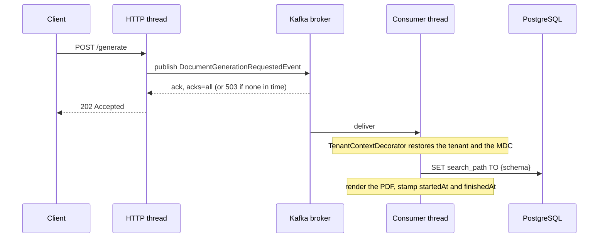

# 0002. Kafka, acknowledged before the 202, with a dead-letter queue

*An accepted request is durable before the caller hears it was accepted.*

## Context

`@Async` on a thread pool has two failure modes that matter in production.
Under a burst the pool fills, and callers get `RejectedExecutionException`
or block. A restart drops everything in flight. Neither leaves a record, a
retry or an alert, and neither can be seen from outside.

## Decision

`POST /v1/documents/{id}/generate` publishes an event to Kafka and answers
`202` only once the broker has acknowledged it with `acks=all`. The producer
waits seconds, not the client defaults of 60 s for metadata and 120 s for
delivery; a broker that does not confirm in time gets the caller a `503`,
nothing is queued, the document stays `PENDING`, and asking again is safe.

A worker consumes the event with `@RetryableTopic`: three attempts, 1 s and
2 s apart. A failed attempt leaves the document `PROCESSING`, so the retry
renders again; only the dead-letter handler marks it `FAILED`. Delivery is
at least once, so the worker is idempotent: an event for a finished document
(two `generate` calls while it was `PENDING`) is skipped, not retried.

The tenant crosses the thread boundary in the event. `TenantContextDecorator`
sets the schema and the logging context before any connection is checked
out and clears both in `finally`, so every consumer gets the same
restore-and-clear without repeating it.

The document keeps when each stage happened on the server's clock: the
event carries `queuedAt`, the moment `generate` was accepted, and the worker
writes `startedAt` and `finishedAt`. Only the worker writes them, so the
request path gains no write to race with it. On a local machine a document
waits about 10 to 30 ms in Kafka and renders in about 30 to 40 ms.

## Consequences

- The broker is on the write path of `generate`: when it is down, callers
  get `503`, and the contract says so.
- Consumer lag is a metric and the retry policy is configuration, not a
  catch block. Events that exhaust their attempts wait in
  `document.generation.requested.dlq` for inspection and replay.
- Clients learn the outcome by reading the document; a webhook on
  completion is on the roadmap.
